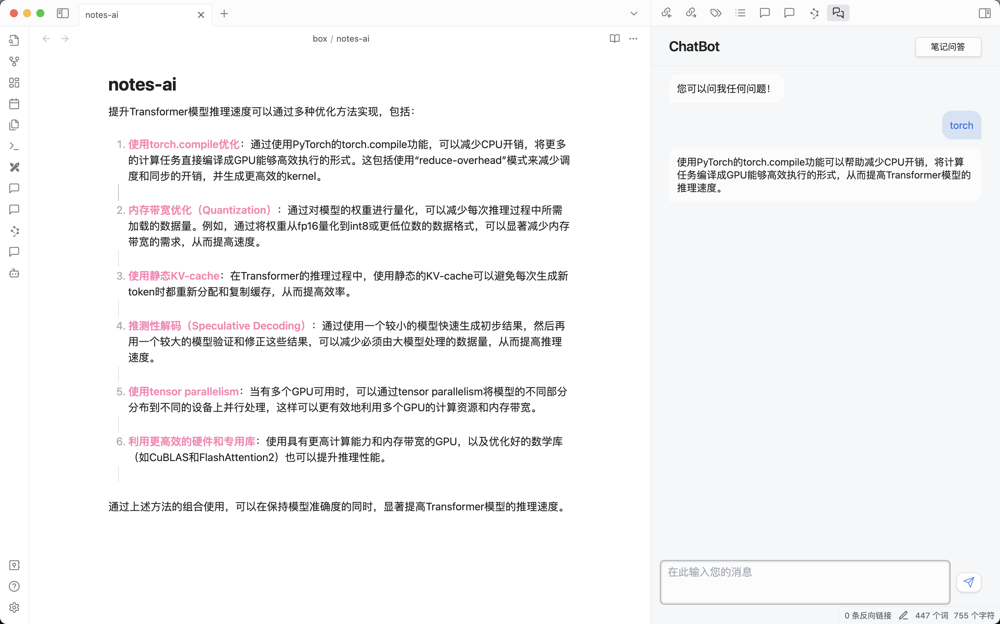

# Obsidian PrivateAI Plugin


Das Obsidian PrivateAI Plugin (PrivateAI) ist ein innovatives Plugin für Obsidian, das darauf abzielt, fortschrittliche KI-Technologie zur Interaktion mit Ihren lokalen Notizen zu nutzen. Das Plugin wurde entwickelt, um die Effizienz des Wissensmanagements und der Wissensnutzung zu verbessern, Benutzern zu helfen, Informationen zu verfeinern und zusammenzufassen, und neue Erkenntnisse zu generieren. PrivateAI unterstützt mehrere Sprachen, einschließlich vereinfachtem Chinesisch, traditionellem Chinesisch, Englisch und Deutsch.

## Funktionen

* **Wissensdatenbank Q&A**: Implementieren Sie modernste RAG-Anwendungen in Obsidian, um schnell Antworten aus Ihrer Wissensdatenbank zu erhalten.
* **Gedankenzusammenfassung und -konstruktion**: Nutzen Sie die neuesten großen Sprachmodelle, um Wissen zu verfeinern und zusammenzufassen und neue Ideen zu generieren.
* **Local First**: Unterstützt Ollama-Lösungen vor Ort, einschließlich LLM- und Embedding-Modelle, um Datenprivatsphäre und schnelle Reaktionen zu gewährleisten.
* **OpenAI-Schnittstellenunterstützung**: Für Benutzer, die keine lokale Bereitstellung durchführen können, bietet dieses Plugin Unterstützung für OpenAI-Schnittstellen mit anpassbaren Konfigurationen.
* **i18n-Anpassung**: Unterstützt mehrere Sprachen; derzeit werden Englisch, vereinfachtes Chinesisch, traditionelles Chinesisch und Deutsch unterstützt.

Das Plugin bietet drei Dialogmodi:

* **NativeQA**: Direktes Gespräch mit dem Modell, geeignet für allgemeine Fragestellungen.
* **NoteQA**: Nutzt die aktuell geöffnete Notiz als Kontext, um mit dem Modell zu kommunizieren, was ein tiefes Verständnis und eine Erweiterung des Notizinhalts ermöglicht.
* **VaultQA**: Cross-Note-Dialog innerhalb des Vaults zur intelligenten Zusammenfassung und Wissensextraktion.

## Schnittstellen-Vorschau



## Installation und Konfiguration

### Anforderungen

- Obsidian 1.5.x
- Ollama-Lösung vor Ort (optional)
- OpenAI-API-Schlüssel (optional)

### Installationsschritte

1. **Herunterladen und Installieren des Plugins** (Noch nicht veröffentlicht, empfohlen [die Beta-Version über das BRAT-Plugin zu installieren](#installation-der-brat-beta-version))

  Suchen Sie im Obsidian-Plugin-Markt nach "PrivateAI" und klicken Sie auf Installieren, oder beziehen Sie sich auf das unten stehende Kapitel, [installieren Sie die Beta-Version über das BRAT-Plugin](#installation-der-brat-beta-version). Nach der Installation vergessen Sie nicht, das Plugin in den Einstellungen für Community Plugins zu aktivieren.

2. **Plugin konfigurieren**

   Gehen Sie zur Einstellungsseite in Obsidian, finden Sie das „PrivateAI“-Plugin und konfigurieren Sie die lokale Lösung oder die OpenAI-Schnittstelle gemäß Ihren Anforderungen.

   - **Lokale Lösung (Local First)**: Erfordert das Herunterladen und Konfigurieren von Ollama-Modellen; siehe [Ollama Offiziell](https://ollama.com/).
     - Konfigurieren Sie die Ollama-Schnittstelle (Standard: localhost:11434)
     - Geben Sie den LLM-Modellnamen an (erforderlich)
     - Konfigurieren Sie den Embedding-Modellnamen (erforderlich)
     - Stellen Sie sicher, dass der Ollama-Dienst so konfiguriert ist, dass er die Umgebungsvariable `OLLAMA_ORIGINS=app://obsidian.md*` unterstützt (Erforderlich)
   - **OpenAI-Schnittstelle**:
     - Geben Sie Ihren OpenAI-API-Schlüssel ein (erforderlich)
     - Konfigurieren Sie das zu verwendende LLM-Modell (Standard: `gpt-3.5-turbo`, empfohlen `gpt-4o`)
     - Konfigurieren Sie das zu verwendende Embedding-Modell (Standard: `text-embedding-3-small`)

> Die obigen Konfigurationen können beliebig kombiniert werden, zum Beispiel:
> * Verwenden des LLM-Modells von OpenAI, während das Embedding-Modell von Ollama verwendet wird.
> * Verwenden des LLM-Modells von Ollama, während das Embedding-Modell von OpenAI verwendet wird.

3. **Starten Sie die PrivateAI-Plugin-Schnittstelle**
Sie können die Plugin-Schnittstelle auf eine von zwei Arten aktivieren:
* Klicken Sie in der linken Seitenleiste auf das Roboterbild 
* Verwenden Sie `Cmd+p`, um das Befehlsfeld zu öffnen, geben Sie `privateai` ein, und 'Chatansicht öffnen' wird angezeigt.

#### Installation der BRAT-Beta-Version

* Suchen Sie im Obsidian-Plugin-Markt nach BRAT und klicken Sie auf Installieren. Starten Sie nach der Installation das BRAT-Plugin.
* Klicken Sie in den BRAT-Einstellungen auf "Add Beta Plugin" und geben Sie `https://github.com/muzhi1991/obsidian-private-ai` ein.
* Klicken Sie auf "Add Plugin", um die Installation abzuschließen. Das Plugin wird automatisch aktiviert und Sie können es unter "PrivateAI" in den Einstellungen konfigurieren.

#### Manuelle Installation

* Navigieren Sie zum Verzeichnis `.obsidian/plugins` innerhalb Ihres Obsidian Vault, welches Sie unter 'Select open another Vault' in der unteren linken Ecke der Schnittstelle finden 
* Laden Sie die neueste Version aus dem [Release](https://github.com/muzhi1991/obsidian-private-ai/releases/latest) in das Verzeichnis .obsidian/plugins herunter, zum Beispiel, wenn das heruntergeladene Archiv obsidian-private-ai.tar.gz heißt, dann entpacken Sie es im Verzeichnis .obsidian/plugins.

```bash
  cd ${Vault_Dir}/.obsidian/plugins
  wget https://github.com/muzhi1991/obsidian-private-ai/releases/latest/download/obsidian-private-ai.tar.gz -O obsidian-private-ai.tar.gz
  tar xvf obsidian-private-ai.tar.gz
```

## FAQ

#### Wie man Local First implementiert

Dieses Plugin verwendet Ollama zur Unterstützung der lokalen Bereitstellung von LLM- und Embedding-Modellen. Für Benutzer, die sich um die Datensicherheit sorgen, wird empfohlen, [Ollama](https://ollama.com/) auf ihrem System für die lokalisierten Bereitstellung zu installieren. Nach der Installation laden Sie Modelle herunter, die für Ihre Maschinenkonfiguration geeignet sind (7B/14B-Modelle werden für eine ausgewogene Leistung und Geschwindigkeit empfohlen).

Wenn Serviceanforderungen fehlschlagen, überprüfen Sie:
* Ob die Ollama-URL-Konfiguration korrekt ist
* Ob der Ollama-Dienst erfolgreich gestartet wurde und der Port zugänglich ist; Sie können dies mit `telnet localhost 11434` testen
* Ob die Umgebungsvariable `OLLAMA_ORIGINS=app://obsidian.md*` oder `OLLAMA_ORIGINS=*` beim Starten des Ollama-Dienstes gesetzt ist (dies ist sehr wichtig, da der Ollama-Server CORS überprüft)

#### Über OpenAI-Konfigurationsprobleme

> !! Hinweis: 
> * Beim Verwenden von OpenAI werden Daten an OpenAI-Server gesendet, daher vorsichtig vorgehen.
> * Die Nutzung der OpenAI-Dienste verursacht [Kosten](https://openai.com/api/pricing).

Wenn die Leistung Ihres lokalen Rechners nicht ausreicht, wird empfohlen, die GPT-4-Serienmodelle von OpenAI zu verwenden, insbesondere GPT-4o, um die beste Leistung zu erzielen. Sie müssen den [API-Schlüssel von der offiziellen Website](https://platform.openai.com/account/api-keys) konfigurieren.

## Beitrag und Feedback

Beiträge und Feedback sind willkommen!

- **Probleme melden**: Wenn Sie Probleme haben oder Verbesserungsvorschläge haben, melden Sie bitte ein Problem.
- **Pull Requests**: Wenn Sie uns helfen möchten, Funktionen zu verbessern, sind Sie willkommen, Pull Requests einzureichen.
- **Feedback und Kontakt**: Wir schätzen Ihr wertvolles Feedback, bitte kontaktieren Sie uns über GitHub.

## Fahrplan

- Workspace-Management-Funktionalität für Chat-Verlauf
- Eingebautes einfaches Embedding-Modell für einfache Indexierung

## Lizenz

Dieses Projekt ist unter der Apache 2.0-Lizenz lizenziert, siehe die [LIZENZ](./LICENSE)-Datei für Details.